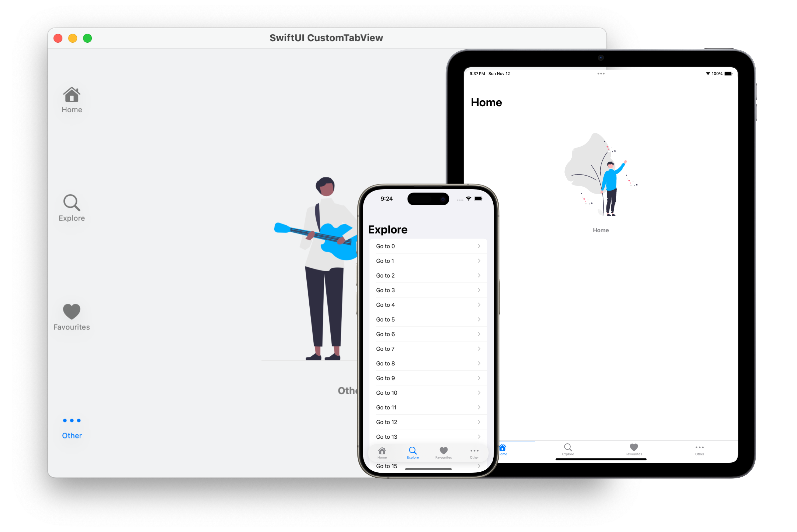
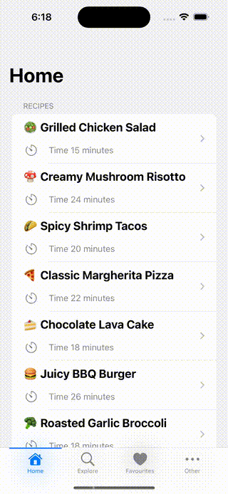

<div align="center">



# SwiftUI CustomTabView


</div>

CustomTabView is a SwiftUI component that empowers developers to create customizable tab views with ease. It is designed to provide maximum flexibility and a seamless user experience.

## Why CustomTabView?

### 1. **Unparalleled Customization**

CustomTabView gives you full control over the appearance of your tab bar.  
Whether you want a minimalistic design or a vibrant, animated tab bar, all you need to do is tailor the tab bar to fit the visual identity of your app and CustomTabView will take care of the rest.

### 2. **Honored SwiftUI View Lifecycle Updates**

Embrace the full potential of SwiftUI's view lifecycle updates with CustomTabView. The library seamlessly integrates with [`onAppear(perform:)`](https://developer.apple.com/documentation/swiftui/view/onappear(perform:)), [`onDisappear(perform:)`](https://developer.apple.com/documentation/swiftui/view/ondisappear(perform:)), and [`task(priority:_:)`](https://developer.apple.com/documentation/swiftui/view/task(priority:_:)) methods, ensuring that each time you switch tabs from the tab bar, these lifecycle events are triggered.

> **Note:**  
This behavior distinguishes CustomTabView from common custom tab view implementations that rely on a `ZStack` to overlay tab views, potentially missing out on these crucial view lifecycle updates.

### 3. **Preserved View State Between Tab Changes**
   
CustomTabView preserves the state of your views between tab changes. Whether you're navigating between tabs while performing essential actions in your app, each return to a previously selected tab guarantees finding the view in the exact state you left it.

> **Note:**  
This behavior distinguishes CustomTabView from common custom tab view implementations that use a `switch` mechanism, leading to the recreation of views every time the user switches tabs.


<div align="center">
    
</div>

## Installation

### Swift Package Manager
Add this repository as a dependency in your [`Package.swift`](https://developer.apple.com/documentation/swift_packages/package):

```swift
// swift-tools-version:5.0

import PackageDescription

let package = Package(
    ...,
    dependencies: [
        .package(url: "https://github.com/NicFontana/SwiftUI-CustomTabView.git", .upToNextMajor(from: "1.0.0"))
    ],
    ...
)
```

### Xcode
Select File \> Swift Packages \> Add Package Dependency, then enter the following URL:

```
https://github.com/NicFontana/SwiftUI-CustomTabView.git
```

For more details, see [Adding Package Dependencies to Your App](https://developer.apple.com/documentation/xcode/adding_package_dependencies_to_your_app).

## Usage

To integrate CustomTabView into your project, follow these simple steps:

#### 1. Create your custom tab bar:
```swift
enum Tab: String, Hashable, CaseIterable {
    case home, explore, favourites, other
}

struct SampleTabBarView: View {
    @Binding var selection: Tab
    let onTabSelection: (Tab) -> Void

    var body: some View {
        HStack {
            ForEach(Tab.allCases, id: \.self) { tab in
                tabBarItem(for: tab)
                    .frame(maxWidth: .infinity)
                    .contentShape(Rectangle())
                    .onTapGesture {
                        selection = tab
                        onTabSelection(tab)
                    }
            }
        }
    }

    private func tabBarItem(for tab: Tab) -> some View {
        ...
    }
}
```

#### 2. Initialise a `CustomTabView`:
```swift
import SwiftUI
import CustomTabView

@main
struct CustomTabViewExampleApp: App {

    @State private var selectedTab: Tab = .home

    private var tabBarView: SampleTabBarView {
        SampleTabBarView(selection: $selectedTab) { tab in
            print("Enjoying a custom TabView")
        }
    }

    var body: some Scene {
        WindowGroup {
            CustomTabView(tabBarView: tabBarView, tabs: Tab.allCases, selection: selectedTab) {
                NavigationView {
                    Text("Home")
                        .navigationBarTitle("Home")
                }

                NavigationView {
                    Text("Explore")
                        .navigationBarTitle("Explore")
                }

                NavigationView {
                    Text("Favourites")
                        .navigationBarTitle("Favourites")
                }

                NavigationView {
                    Text("Other")
                        .navigationBarTitle("Other")
                }
            }
        }
    }
}
```

> **Important**  
The order of the views **must** be reflected in the provided tab bar.

#### 3. (Optional) Change the tab bar position
You can change the tab bar position calling the `tabBarPosition(_:)` method on `CustomTabView`:

```swift
CustomTabView(tabBarView: tabBarView, tabs: Tab.allCases, selection: selectedTab) {
    ...
}
.tabBarPosition(.edge(.bottom))
```

Supported positions are:
- `edge(Edge)`: to place the tab bar at one edge of the screen
- `floating(Edge)`: to let the tab bar float above the content while staying at one edge of the screen

## Contributions and Issues

Contributions are welcome! If you find any issues or have suggestions for improvements, please open an issue or submit a pull request. Let's make CustomTabView even better together.

## Acknowledgments

A special thanks to the team at [Moving Parts](https://movingparts.io/) for their insightful article on ["Variadic Views in SwiftUI"](https://movingparts.io/variadic-views-in-swiftui). 
Their valuable insights and exploration of SwiftUI internals greatly contributed to the development of CustomTabView, allowing me to mimic the elegance of SwiftUI's native component APIs. 

## License

CustomTabView is available under the MIT license. See [LICENSE](/LICENSE) for details.